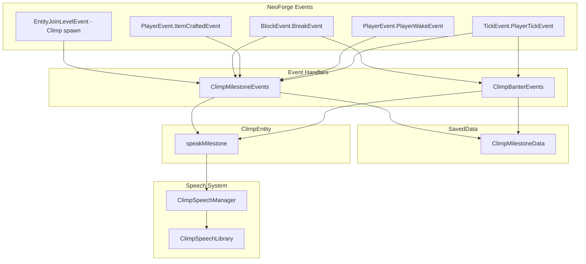

# v0.5.0 Plan: Week-One Companionship (Days 0–7)

**Based on:** [fresh_world_progression.md](docs/backlog/fresh_world_progression.md)

---

## Release Goal

**Definition of Done:** A fresh-world player who spawns Climp and plays through a typical first week (Days 0–7) receives contextually appropriate commentary at key progression milestones, without spam or immersion breaks.

**Success Criteria:**

- Each milestone fires exactly once per player per world.
- All milestone lines play only when Climp is spawned and within range (~16 blocks).
- No crashes, no performance regressions.
- Build succeeds; `./scripts/deploy_to_instance.sh` produces a working mod.

---

## Architecture




**Speech delivery bridge — why `ClimpEntity.speakMilestone()` and not something else:**

Milestone event handlers are static methods that fire when something happens in the world (a block is broken, an item is crafted, etc.). They have no built-in reference to any specific Climp entity. When they find a nearby Climp, they get a `ClimpEntity` object — but `ClimpSpeechManager` is a private field on that object, so they cannot reach inside it.

There are three ways to solve this:

1. Make `ClimpSpeechManager` static — breaks all per-entity state (idle cooldowns, etc.). Not viable.
2. Add a public getter `climp.getSpeechManager()` — works, but forces every event handler to know about `ClimpSpeechManager` internals. Leaky.
3. Add a single public method `climp.speakMilestone(player, type)` on `ClimpEntity` — the event handler calls this one method. `ClimpEntity` delegates internally to its own `speechManager`. External code never touches `ClimpSpeechManager` directly.

**Decision: Option 3.** Add `public void speakMilestone(ServerPlayer player, ClimpSpeechType type)` to `ClimpEntity`. This method delegates to a new `ClimpSpeechManager.sendMilestone(ClimpEntity climp, ServerPlayer player, ClimpSpeechType type)` instance method. Event handlers call only `climp.speakMilestone(player, type)` — nothing else.

---

## Implementation Items

### 1. Milestone SavedData

**File:** `src/main/java/com/asbjborg/climp/data/ClimpMilestoneData.java`

New SavedData (pattern from [ClimpSpawnGiftData.java](src/main/java/com/asbjborg/climp/data/ClimpSpawnGiftData.java)) storing per-player, per-world milestone flags:

- `firstClimpSpawned`
- `firstLogBroken`
- `firstWoodenAxeCrafted`
- `firstShelterSealed`
- `firstNightSurvived`
- `firstBedSlept`
- `firstCoalFound`
- `firstFurnaceCrafted`
- `firstIronFound`
- `firstBucketCrafted`
- `firstDoorPlaced`

Use `DimensionDataStorage` (overworld). Store as `Map<UUID, Set<String>>`; persist/load via NBT as a `ListTag` of compound tags, each containing a `player_uuid` UUID field and a `ListTag` of milestone name strings.

**Goal:** Persist milestone state across sessions. No duplicate triggers.

---

### 2. Milestone Event Handler

**File:** `src/main/java/com/asbjborg/climp/event/ClimpMilestoneEvents.java`

Register on `NeoForge.EVENT_BUS` in [ClimpMod.java](src/main/java/com/asbjborg/climp/ClimpMod.java).

**Handlers:**


| Event                                       | Condition                                                                                                                                                                                | Milestone               | Trigger Logic                                                                             |
| ------------------------------------------- | ---------------------------------------------------------------------------------------------------------------------------------------------------------------------------------------- | ----------------------- | ----------------------------------------------------------------------------------------- |
| `EntityJoinLevelEvent`                      | Entity is Climp, nearest player within 5 blocks, player has not `firstClimpSpawned`                                                                                                      | `firstClimpSpawned`     | Fire intro line; mark milestone.                                                          |
| `BlockEvent.BreakEvent`                     | Block is log (BlockTags.LOGS), player has not `firstLogBroken`, Climp in range                                                                                                           | `firstLogBroken`        | Fire line; mark.                                                                          |
| `PlayerEvent.ItemCraftedEvent`              | Result is wooden axe, player has not `firstWoodenAxeCrafted`, Climp in range                                                                                                             | `firstWoodenAxeCrafted` | Fire line; mark.                                                                          |
| `BlockEvent.EntityPlaceEvent`               | Placed block is solid OR a door; 2-tall exit count drops from ≥ 1 to 0 (sealed), player is indoors (!canSeeSky), timeOfDay >= 11000, player has not `firstShelterSealed`, Climp in range | `firstShelterSealed`    | Fire line (small/medium/large variant by airCount); mark.                                 |
| `TickEvent.PlayerTickEvent` (server)        | At dawn of **Day 1 specifically** (`day == 1`, `timeOfDay < 1000`), `TIME_SINCE_REST >= 24000` (no sleep since spawn), player has not `firstNightSurvived`, Climp in range               | `firstNightSurvived`    | Fire line; mark milestone.                                                                |
| `PlayerEvent.PlayerWakeEvent` or equivalent | Player woke at dawn (`level.getDayTime() % 24000 < 500` after waking — confirms completed sleep, not interrupted), player has not `firstBedSlept`, Climp in range                        | `firstBedSlept`         | Fire line; mark milestone.                                                                |
| `BlockEvent.BreakEvent`                     | Block is coal ore (BlockTags.COAL_ORES), player has not `firstCoalFound`, Climp in range                                                                                                 | `firstCoalFound`        | Fire line; mark.                                                                          |
| `PlayerEvent.ItemCraftedEvent`              | Result is furnace, player has not `firstFurnaceCrafted`, Climp in range                                                                                                                  | `firstFurnaceCrafted`   | Fire line; mark.                                                                          |
| `BlockEvent.BreakEvent`                     | Block is iron ore (BlockTags.IRON_ORES), player has not `firstIronFound`, Climp in range                                                                                                 | `firstIronFound`        | Fire line; mark.                                                                          |
| `PlayerEvent.ItemCraftedEvent`              | Result is bucket, player has not `firstBucketCrafted`, Climp in range                                                                                                                    | `firstBucketCrafted`    | Fire line; mark.                                                                          |
| `BlockEvent.EntityPlaceEvent`               | Placed block is a door, player has not `firstDoorPlaced`, Climp in range                                                                                                                 | `firstDoorPlaced`       | Fire line; mark. **Return immediately — do not also evaluate door banter on this event.** |


`**firstNightSurvived` vs `firstBedSlept` — independent milestones, not mutually exclusive:**

These two milestones track different things and have no ordering dependency on each other:

Night 1 has two paths: sleep through it, or stay awake through it. Whichever path the player does not take on Night 1, that milestone remains available on any future night.

- `firstNightSurvived`: fires the **first time the player survives a full night without sleeping** — checked at dawn if `TIME_SINCE_REST >= 24000`. This is most naturally Night 1, but fires on whichever night they first stay awake through.
- `firstBedSlept`: fires the **first time the player sleeps through a night in a bed** — checked on wake if `getDayTime() % 24000 < 500`. This is most naturally Night 1, but fires on whichever night they first sleep.

A player who sleeps Night 1 earns `firstBedSlept` immediately and can still earn `firstNightSurvived` any later night they choose to stay awake. A player who stays awake Night 1 earns `firstNightSurvived` at dawn and can still earn `firstBedSlept` any later night they first sleep. Both milestones are always reachable; no mutual exclusion guard is needed.

`**PlayerWakeEvent` — filter for completed sleep only:**

`PlayerEvent.PlayerWakeEvent` fires on any wake-up, including when sleep is interrupted (monster nearby, player forced awake). For `firstBedSlept`, guard with `level.getDayTime() % 24000 < 500` after waking — this confirms the player slept through to morning rather than being kicked out mid-sleep.

**Climp-in-range check (all milestone handlers):**

Search from the **player's position** (not from Climp's), because milestone events are player-initiated. Use:

```java
List<ClimpEntity> nearbyClimp = level.getEntitiesOfClass(
    ClimpEntity.class, player.getBoundingBox().inflate(16));
if (nearbyClimp.isEmpty()) return;
ClimpEntity climp = nearbyClimp.get(0);
climp.speakMilestone(player, type);
```

This is consistent with the event origin being the player. (The existing idle speech uses `climp.level().getNearestPlayer(climp, 7.0D)` because it originates from Climp's tick — milestone handlers originate from the player, so they search from the player.)

**At-dawn definition:** `timeOfDay < 1000` with `day >= 1`, where `day = floor(level.getDayTime() / 24000)` and `timeOfDay = level.getDayTime() % 24000`.

**Panic-burrow "sealed" heuristic (see Section 5 for full detail):**

An exit is a 2-block-tall traversable opening: both the foot-level neighbor and the head-level neighbor (foot+1) in the same cardinal direction must be passable (air or door). Scan N/E/S/W. Fire milestone when `exitCountBefore >= 1` and `exitCountAfter == 0`.

Space-size classification (for which shelter line to play):

- Count air blocks in a `3x3x3` cube centered on the player after sealing.
- Suggested buckets: `small <= 12`, `medium 13–30`, `large > 30`.
- Use this to select which shelter variant line to play (cozy/claustrophobic vs spacious/fancy).

---

### 3. Speech System Extensions

`**ClimpSpeechLibrary` — migrate to `Map.ofEntries` before adding new types:**

`Map.of(...)` is hard-capped at 10 key-value pairs and throws a runtime `IllegalArgumentException` if exceeded. The current library has 6 entries and is safe, but adding the new types will push it past 10. `ClimpSoundEvents` already uses `Map.ofEntries(Map.entry(...), ...)` — use the same pattern. **This migration must happen before any new `ClimpSpeechType` entries are added to the library.**

```java
private static final Map<ClimpSpeechType, List<Line>> LINES = Map.ofEntries(
        Map.entry(ClimpSpeechType.IDLE, List.of(...)),
        Map.entry(ClimpSpeechType.HIT, List.of(...)),
        // ... all existing and new entries
);
```

`**ClimpSpeechType**` ([ClimpSpeechType.java](src/main/java/com/asbjborg/climp/speech/ClimpSpeechType.java)): Add enum values:

- `INTRO`
- `MILESTONE_FIRST_WOOD`
- `MILESTONE_FIRST_AXE`
- `MILESTONE_SHELTER_SMALL`
- `MILESTONE_SHELTER_MEDIUM`
- `MILESTONE_SHELTER_LARGE`
- `MILESTONE_FIRST_NIGHT`
- `MILESTONE_FIRST_COAL`
- `MILESTONE_FIRST_FURNACE`
- `MILESTONE_FIRST_IRON`
- `MILESTONE_FIRST_BUCKET`
- `MILESTONE_FIRST_DOOR`
- `MILESTONE_FIRST_BED`
- `BANTER_TORCH_MINING`
- `BANTER_DOOR_PLACED`
- `BANTER_ZOMBIE_HEARD`

`**ClimpSpeechManager**` ([ClimpSpeechManager.java](src/main/java/com/asbjborg/climp/speech/ClimpSpeechManager.java)): Add `sendMilestone(ClimpEntity climp, ServerPlayer player, ClimpSpeechType type)` instance method with these rules:

- Calls `send(climp, player, type, randomLine)` directly — **bypasses `idleCooldownTicks` entirely**. Milestone moments must fire immediately regardless of idle state; they are not subject to idle gating.
- Does **not** use `lastSoundIdByType` for deduplication. Each milestone fires at most once per world; dedup is irrelevant.
- After delivery, sets `idleCooldownTicks = Math.max(idleCooldownTicks, 20 * 10)` to suppress idle chatter for ~10 seconds following a milestone moment. Milestone commentary should not be immediately followed by unrelated idle lines.

`**ClimpEntity`**: Add `public void speakMilestone(ServerPlayer player, ClimpSpeechType type)` that calls `speechManager.sendMilestone(this, player, type)`. This is the only entry point for milestone/banter delivery from event handlers. No event handler should reference `ClimpSpeechManager` directly.

`**ClimpSpeechLibrary**`: Add mapping for each new type. Initially 1–2 lines per type (random pick allowed). Banter types must respect global cooldown + per-type cooldown (e.g. once per in-game day for door banter; every 20 qualifying torches for torch banter). Zombie banter must use a per-player cooldown (minutes, not seconds) to avoid repeating during combat.

`**ClimpSoundEvents**` ([ClimpSoundEvents.java](src/main/java/com/asbjborg/climp/sound/ClimpSoundEvents.java)), **sounds.json**, **voicelines.json**: Add entries for each new line. Use `scripts/generate_va.py` workflow to generate VA and wire in.

---

### 4. VA Content

**File:** [docs/va/voicelines.json](docs/va/voicelines.json)

Add new categories/entries:

- `intro`
- `milestone_first_wood`
- `milestone_first_axe`
- `milestone_shelter_small`
- `milestone_shelter_medium`
- `milestone_shelter_large`
- `milestone_first_night`
- `milestone_first_coal`
- `milestone_first_furnace`
- `milestone_first_iron`
- `milestone_first_bucket`
- `milestone_first_door`
- `milestone_first_bed`
- `banter_torch_mining`
- `banter_door_placed`
- `banter_zombie_heard`

Run `generate_va.py` to produce `.ogg`, update `ClimpSpeechLibrary`, `ClimpSoundEvents`, `sounds.json`.

---

### 5. "Shelter Sealed" (Panic Burrow) Refinement

**Trigger:** First time the player seals themselves into an indoor space late in the day (classic "panic burrow" / first shelter moment).

**Preferred event:** `BlockEvent.EntityPlaceEvent` (server).

**Core conditions:**

- `timeOfDay >= 11000` (late afternoon / approaching night)
- Player is indoors: `!level.canSeeSky(player.blockPosition())`
- Placement "seals" the space (see 2-tall exit heuristic below)
- Climp is within 16 blocks of the player
- Milestone `firstShelterSealed` has not fired for this player/world

**2-tall exit heuristic:**

A player needs a 2-block-tall gap to walk through. An **exit** is a cardinal direction (N/E/S/W) where **both** the foot-level neighbor block and the head-level neighbor block (foot+1) are passable:

- Air at both positions → exit.
- A door at foot position (with air or door at head position) → exit. Doors count as traversable even when closed.
- Any solid non-door block at either position → not an exit.

Compute `exitCountBefore` (before the block is placed) and `exitCountAfter` (with the new block simulated). Fire if `exitCountBefore >= 1` and `exitCountAfter == 0`.

**This correctly captures the two common sealing patterns:**

1. Player stacks two solid blocks to fill a doorway (dirt, cobblestone, etc.) — the milestone fires on the **second** block placement, when the gap is fully closed.
2. Player places a door — the door covers both foot and head heights simultaneously, dropping exits to 0 in one placement.

**Line style:** Must be "forgivable" if misclassified (no explicit "panic" wording). Examples: "Is this our new home?" / "I could see us live here forever."

**Variant selection:** Choose between small/medium/large shelter lines using airCount classification (3×3×3 cube, `small <= 12`, `medium 13–30`, `large > 30`).

**Known limitation:** The heuristic only checks 4 cardinal directions and does not account for diagonal gaps, slabs, or trapdoors. Misclassifications are acceptable because the line style is deliberately non-committal.

---

### 6. Repeatable Banter Triggers (Torch / Door / Zombie)

These are not milestones. They are repeatable but rate-limited "banter" lines to keep Climp lively without becoming spammy.

**File:** `src/main/java/com/asbjborg/climp/event/ClimpBanterEvents.java`

Banter lives in its own dedicated class, separate from `ClimpMilestoneEvents`. This matters now and will matter more as banter grows — there will be many future banter triggers across many different contexts. Keeping banter separate from milestone logic ensures neither class becomes a dumping ground. Both classes are registered on `NeoForge.EVENT_BUS` in `ClimpMod.java`.

**Banter counter state — all counters are transient (in-memory only):**

`undergroundDarkTorchCount`, `doorsPlacedCount`, `lastDoorBanterDay`, and per-player zombie cooldown ticks are stored as `Map<UUID, ...>` fields **on `ClimpBanterEvents`** (not `ClimpMilestoneEvents`). They are initialized to 0 on server start and **reset on server restart or reload — this is intentional**. Banter does not need to survive restarts. Losing a torch counter mid-strip-mine after a reload is acceptable behavior; banter is flavor, not progression.

#### 6.1 Torch banter (strip mining cozy fire)

- Event: `BlockEvent.EntityPlaceEvent` when placing `torch` or `wall_torch`.
- Only count placements when `!canSeeSky(playerPos)` and local brightness before placement is `<= 7`.
- Maintain per-player counter `undergroundDarkTorchCount` (transient `Map<UUID, Integer>`).
- Fire `BANTER_TORCH_MINING` when `undergroundDarkTorchCount % 20 == 0` AND global speech cooldown allows AND Climp is within 16 blocks of the player.

Example line: "Ah yes… open fire. Totally safe. And very cozy!"

#### 6.2 Door banter (civilization moment)

- Separate from the shelter milestone; does not require sky checks.
- Maintain per-player `doorsPlacedCount` (transient `Map<UUID, Integer>`) and `lastDoorBanterDay` (transient `Map<UUID, Long>`).
- Fire `BANTER_DOOR_PLACED` at most once per Minecraft day when a door is placed and Climp is within 16 blocks of the player.

**Door milestone vs. door banter — cross-class coordination via `ClimpMilestoneData`:**

`ClimpMilestoneEvents` and `ClimpBanterEvents` both listen to `BlockEvent.EntityPlaceEvent` on door blocks, but each handles a different case. They coordinate through `ClimpMilestoneData` as shared read-only state:

- `ClimpMilestoneEvents` fires the `firstDoorPlaced` milestone when `!hasMilestone("firstDoorPlaced")` and Climp is in range. It marks the milestone and returns. It does not touch banter counters.
- `ClimpBanterEvents` checks `hasMilestone("firstDoorPlaced")` first. If the milestone has not yet fired, it skips entirely — the milestone handler will cover this event. If the milestone has already fired, it increments `doorsPlacedCount`, checks `lastDoorBanterDay`, and fires banter if eligible.

`ClimpMilestoneData` is the single source of truth. Neither class needs to know the other exists; they coordinate implicitly by reading the same persisted state.

#### 6.3 Zombie sound banter (oblivious sidekick)

- Goal: When a zombie is close enough that the player can plausibly hear it, Climp reacts with an "oblivious" line that lets the player feel like the knowledgeable one.
- Event: `TickEvent.PlayerTickEvent` (server), sampled every 20 ticks to avoid cost.
- Detection (cheap heuristic):
  - Search for `Zombie`-type entities within radius `R = 16` of the player (or 12 if too chatty).
  - Require zombie is alive and not silent.
  - Optional: prefer zombies not in direct sunlight (feels more "night/cave").
- Gating:
  - Only fire if Climp is within 16 blocks of the player.
  - Per-player cooldown: at most once every 2–3 in-game minutes (e.g. 2400–3600 ticks). Stored in transient `Map<UUID, Integer> zombieBanterCooldownByPlayer`.
  - Optional "rarity" gate: only fire with 30–50% chance when eligible to keep it surprising.
- Speech type: `BANTER_ZOMBIE_HEARD`.

Example lines: "What was THAT?!" / "Did you just yawn?" / "I heard… mouth noises."

---

## GitHub Issues (Checklist)


| Title                                           | Summary                                                                                                                   |
| ----------------------------------------------- | ------------------------------------------------------------------------------------------------------------------------- |
| [0.5.0] Add ClimpMilestoneData SavedData        | Per-player, per-world week-one milestone flags. Load/save via overworld DimensionDataStorage.                             |
| [0.5.0] Intro line on first Climp spawn         | EntityJoinLevelEvent; nearest player, firstClimpSpawned check; fire INTRO line.                                           |
| [0.5.0] First wood milestone                    | BlockEvent.BreakEvent on log; firstLogBroken; Climp in range.                                                             |
| [0.5.0] First wooden axe milestone              | ItemCraftedEvent; result is wooden axe; firstWoodenAxeCrafted; Climp in range.                                            |
| [0.5.0] First shelter sealed milestone          | EntityPlaceEvent; 2-tall exit heuristic; firstShelterSealed; Climp in range; pick small/medium/large shelter line.        |
| [0.5.0] First night survived milestone          | PlayerTickEvent at dawn of Day 1 specifically; firstNightSurvived; TIME_SINCE_REST >= 24000; Climp in range.              |
| [0.5.0] First bed milestone                     | PlayerWakeEvent (woke at dawn, completed sleep); firstBedSlept; Climp in range.                                           |
| [0.5.0] First coal milestone                    | BreakEvent on coal ore; firstCoalFound; Climp in range.                                                                   |
| [0.5.0] First furnace milestone                 | ItemCraftedEvent; result is furnace; firstFurnaceCrafted; Climp in range.                                                 |
| [0.5.0] First iron milestone                    | BreakEvent on iron ore; firstIronFound; Climp in range.                                                                   |
| [0.5.0] First bucket milestone                  | ItemCraftedEvent; result is bucket; firstBucketCrafted; Climp in range.                                                   |
| [0.5.0] First door milestone                    | EntityPlaceEvent; door placed; firstDoorPlaced; Climp in range. Return before banter check.                               |
| [0.5.0] ClimpBanterEvents class setup            | Create ClimpBanterEvents.java; register on NeoForge.EVENT_BUS in ClimpMod; establish transient Map<UUID,...> counter pattern. |
| [0.5.0] Torch banter                            | ClimpBanterEvents; PlaceEvent on torch/wall_torch; undergroundDarkTorchCount; speak every 20 in dark underground.         |
| [0.5.0] Door banter                             | ClimpBanterEvents; PlaceEvent on door; check hasMilestone("firstDoorPlaced") first; once per in-game day; Climp in range. |
| [0.5.0] Zombie banter                           | ClimpBanterEvents; PlayerTick sampling; detect nearby zombies; per-player cooldown; Climp in range; oblivious line.       |
| [0.5.0] Speech types, Library migration, and VA | ClimpSpeechType, Library Map.ofEntries migration, ClimpEntity.speakMilestone, SoundEvents, voicelines.json, generate_va.  |


---

## Order of Implementation

1. **ClimpMilestoneData** (SavedData issue) — foundation for both milestone and banter coordination.
2. **Speech extensions** (speech types + Library migration + `ClimpEntity.speakMilestone` bridge) — migrate `ClimpSpeechLibrary` to `Map.ofEntries` first, then add new `ClimpSpeechType` values, then add VA. Speech wiring must exist before any handler fires a line.
3. **Intro** (intro spawn issue) — simplest; validates the full delivery chain end-to-end.
4. **Block/craft/sleep handlers** (wood through door milestone issues) — can be done in parallel or batched.
5. **`ClimpBanterEvents` class + banter triggers** (banter issues) — set up the class skeleton first, then add torch/door/zombie handlers.
6. **Integration and test** — full fresh-world run verifying all milestones in order, then a banter pass.

---


## Verification

- Create fresh world, receive spawn egg, spawn Climp → intro line plays.
- Break first log with Climp nearby → first wood line.
- Craft wooden axe with Climp nearby → first axe line.
- Seal yourself into an indoor shelter late in the day — place a door, or stack the second solid block to close the last 2-tall opening — with Climp nearby → shelter (small/medium/large) line.
- Survive Night 1 (Day 1) without sleeping, Climp nearby at dawn → first night survived line.
- On any night (Night 1 or later), sleep in a bed and wake at dawn with Climp nearby → first bed line. (If player slept Night 1, `firstNightSurvived` will not fire; `firstBedSlept` fires instead. Both can fire across different nights if player survives Night 1 raw then sleeps later.)
- Break first coal ore with Climp nearby → first coal line.
- Craft furnace with Climp nearby → first furnace line.
- Break first iron ore with Climp nearby → first iron line.
- Craft bucket with Climp nearby → first bucket line.
- Place first door with Climp nearby → first door milestone line (not banter).
- While strip mining, place 20th qualifying torch underground in darkness with Climp nearby → torch banter line.
- Place a door later in the world; ensure door banter fires at most once per in-game day, and does not fire on the first door placement.
- Stand near an audible zombie with Climp nearby; verify zombie banter can trigger, but not more than once every few minutes.
- Reload world, repeat same actions → no duplicate milestone lines.
- Milestones fire only when Climp is within 16 blocks of the player.

