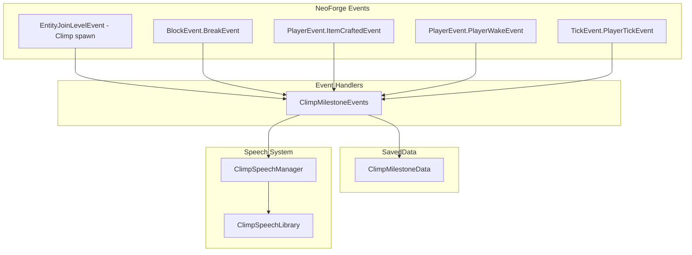

# v0.5.0 Plan: Week-One Companionship (Days 0–7)

**Based on:** [fresh_world_progression.md](docs/backlog/fresh_world_progression.md)

---

## Release Goal

**Definition of Done:** A fresh-world player who spawns Climp and plays through a typical first week (Days 0–7) receives contextually appropriate commentary at key progression milestones, without spam or immersion breaks.

**Success Criteria:**

- Each milestone fires exactly once per player per world.
- All milestone lines play only when Climp is spawned and within range (~16 blocks).
- No crashes, no performance regressions.
- Build succeeds; `./scripts/deploy_to_instance.sh` produces a working mod.

---

## Architecture

---

## Implementation Items

### 1. Milestone SavedData

**File:** `src/main/java/com/asbjborg/climp/data/ClimpMilestoneData.java`

New SavedData (pattern from [ClimpSpawnGiftData.java](src/main/java/com/asbjborg/climp/data/ClimpSpawnGiftData.java)) storing per-player, per-world milestone flags:

- `firstClimpSpawned`
- `firstLogBroken`
- `firstWoodenAxeCrafted`
- `firstShelterSealed`
- `firstNightSurvived`
- `firstBedSlept`
- `firstCoalFound`
- `firstFurnaceCrafted`
- `firstIronFound`
- `firstBucketCrafted`
- `firstDoorPlaced`

Use `DimensionDataStorage` (overworld). Store as `Map<UUID, Set<String>>` or similar; persist/load via NBT.

**Goal:** Persist milestone state across sessions. No duplicate triggers.

---

### 2. Milestone Event Handler

**File:** `src/main/java/com/asbjborg/climp/event/ClimpMilestoneEvents.java`

Register on `NeoForge.EVENT_BUS` in [ClimpMod.java](src/main/java/com/asbjborg/climp/ClimpMod.java).

**Handlers:**

| Event                                       | Condition                                                                                                                                                                         | Milestone               | Trigger Logic                                             |
| ------------------------------------------- | --------------------------------------------------------------------------------------------------------------------------------------------------------------------------------- | ----------------------- | --------------------------------------------------------- |
| `EntityJoinLevelEvent`                      | Entity is Climp, nearest player within 5 blocks, player has not `firstClimpSpawned`                                                                                               | `firstClimpSpawned`     | Fire intro line; mark milestone.                          |
| `BlockEvent.BreakEvent`                     | Block is log (BlockTags.LOGS), player has not `firstLogBroken`, Climp in range                                                                                                    | `firstLogBroken`        | Fire line; mark.                                          |
| `PlayerEvent.ItemCraftedEvent`              | Result is wooden axe, player has not `firstWoodenAxeCrafted`, Climp in range                                                                                                      | `firstWoodenAxeCrafted` | Fire line; mark.                                          |
| `BlockEvent.EntityPlaceEvent`               | Placed block is solid OR a door; placement reduces nearby exits (sealed), player is indoors (!canSeeSky), timeOfDay >= 11000, player has not `firstShelterSealed`, Climp in range | `firstShelterSealed`    | Fire line (small/medium/large variant by airCount); mark. |
| `TickEvent.PlayerTickEvent` (server)        | At dawn on Day 1+, player has not `firstNightSurvived`, player has not slept (Stats.TIME_SINCE_REST >= 24000), Climp in range                                                     | `firstNightSurvived`    | Fire line; mark milestone.                                |
| `PlayerEvent.PlayerWakeEvent` or equivalent | Player slept, has not `firstBedSlept`, Climp in range                                                                                                                             | `firstBedSlept`         | Fire line; mark milestone.                                |
| `BlockEvent.BreakEvent`                     | Block is coal ore (BlockTags.COAL_ORES), player has not `firstCoalFound`, Climp in range                                                                                          | `firstCoalFound`        | Fire line; mark.                                          |
| `PlayerEvent.ItemCraftedEvent`              | Result is furnace, player has not `firstFurnaceCrafted`, Climp in range                                                                                                           | `firstFurnaceCrafted`   | Fire line; mark.                                          |
| `BlockEvent.BreakEvent`                     | Block is iron ore (BlockTags.IRON_ORES), player has not `firstIronFound`, Climp in range                                                                                          | `firstIronFound`        | Fire line; mark.                                          |
| `PlayerEvent.ItemCraftedEvent`              | Result is bucket, player has not `firstBucketCrafted`, Climp in range                                                                                                             | `firstBucketCrafted`    | Fire line; mark.                                          |
| `BlockEvent.EntityPlaceEvent`               | Placed block is a door, player has not `firstDoorPlaced`, Climp in range                                                                                                          | `firstDoorPlaced`       | Fire line; mark.                                          |

**Climp-in-range check:** `level.getEntitiesOfClass(ClimpEntity.class, player.getBoundingBox().inflate(16)).isEmpty()` → false means Climp nearby. Use first Climp for speech position.

At dawn is defined as: `timeOfDay < 1000` with `day >= 1`, where `day = floor(level.getDayTime() / 24000)` and `timeOfDay = level.getDayTime() % 24000`.

Panic-burrow “sealed” heuristic:

- Compute a simple `exitCount` around the player at feet and head height (N/E/S/W at y and y+1). An “exit” is a neighbor position that is air (and optionally sky-accessible).
- Consider the room “sealed” if `exitCountBefore >= 1` and `exitCountAfter == 0` due to the placement event.

Space-size classification (for which shelter line to play):

- Count air blocks in a `3x3x3` cube centered on the player after sealing.
- Suggested buckets: `small <= 12`, `medium 13–30`, `large > 30`.
- Use this to select which shelter variant line to play (cozy/claustrophobic vs spacious/fancy).

---

### 3. Speech System Extensions

**ClimpSpeechType** ([ClimpSpeechType.java](src/main/java/com/asbjborg/climp/speech/ClimpSpeechType.java)): Add enum values:

- `INTRO`
- `MILESTONE_FIRST_WOOD`
- `MILESTONE_FIRST_AXE`
- `MILESTONE_SHELTER_SMALL`
- `MILESTONE_SHELTER_MEDIUM`
- `MILESTONE_SHELTER_LARGE`
- `MILESTONE_FIRST_NIGHT`
- `MILESTONE_FIRST_COAL`
- `MILESTONE_FIRST_FURNACE`
- `MILESTONE_FIRST_IRON`
- `MILESTONE_FIRST_BUCKET`
- `MILESTONE_FIRST_DOOR`
- `MILESTONE_FIRST_BED`
- `BANTER_TORCH_MINING`
- `BANTER_DOOR_PLACED`
- `BANTER_ZOMBIE_HEARD`

**ClimpSpeechLibrary** ([ClimpSpeechLibrary.java](src/main/java/com/asbjborg/climp/speech/ClimpSpeechLibrary.java)): Add mapping for each new type. Initially 1–2 lines per type (random pick allowed, but all milestone lines must still respect milestone once-per-world rules). Banter types must respect global cooldown + per-type cooldown (e.g. once per in-game day for door banter; every 20 qualifying torches for torch banter). Zombie banter must use a per-player cooldown (minutes, not seconds) to avoid repeating during combat.

**ClimpSpeechManager**: Add `sendMilestone(ClimpEntity climp, ServerPlayer player, ClimpSpeechType type)` (or equivalent) that sends to player + plays sound at Climp position. Milestone lines do not use `lastSoundIdByType` (one line per type). May need a static/utility path for when we have Climp but speech originates from event handler (not from ClimpEntity callback).

**ClimpSoundEvents** ([ClimpSoundEvents.java](src/main/java/com/asbjborg/climp/sound/ClimpSoundEvents.java)), **sounds.json**, **voicelines.json**: Add entries for each new line. Use `scripts/generate_va.py` workflow to generate VA and wire in.

---

### 4. VA Content

**File:** [docs/va/voicelines.json](docs/va/voicelines.json)

Add new categories/entries:

- `intro`
- `milestone_first_wood`
- `milestone_first_axe`
- `milestone_shelter_small`
- `milestone_shelter_medium`
- `milestone_shelter_large`
- `milestone_first_night`
- `milestone_first_coal`
- `milestone_first_furnace`
- `milestone_first_iron`
- `milestone_first_bucket`
- `milestone_first_door`
- `milestone_first_bed`
- `banter_torch_mining`
- `banter_door_placed`
- `banter_zombie_heard`

Run `generate_va.py` to produce `.ogg`, update `ClimpSpeechLibrary`, `ClimpSoundEvents`, `sounds.json`.

---

### 5. "Shelter Sealed" (Panic Burrow) Refinement

**Trigger:** First time the player seals themselves into an indoor space late in the day (classic “panic burrow” / first shelter moment).

**Preferred event:** `BlockEvent.EntityPlaceEvent` (server).

**Core conditions:**

- `timeOfDay >= 11000` (late afternoon / approaching night)
- Player is indoors: `!level.canSeeSky(player.blockPosition())`
- Placement “seals” the space: exits drop from `>= 1` to `0` (see heuristic above)
- Climp is within 16 blocks
- Milestone `firstShelterSealed` has not fired for this player/world

**Line style:** Must be “forgivable” if misclassified (no explicit “panic” wording). Examples: “Is this our new home?” / “I could see us live here forever.”

**Variant selection:** Choose between small/medium/large shelter lines using airCount classification.

---

### 6. Repeatable Banter Triggers (Torch / Door / Zombie)

These are not milestones. They are repeatable but rate-limited “banter” lines to keep Climp lively without becoming spammy.

#### 6.1 Torch banter (strip mining cozy fire)

- Event: `BlockEvent.EntityPlaceEvent` when placing `torch` or `wall_torch`.
- Only count placements when `!canSeeSky(playerPos)` and local brightness before placement is `<= 7`.
- Maintain per-player counter `undergroundDarkTorchCount`.
- Fire `BANTER_TORCH_MINING` when `undergroundDarkTorchCount % 20 == 0` AND global speech cooldown allows AND Climp is within 16 blocks.

Example line: “Ah yes… open fire. Totally safe. And very cozy!”

#### 6.2 Door banter (civilization moment)

- Separate from the shelter milestone; do not require sky checks.
- Maintain per-player `doorsPlacedCount` and `lastDoorBanterDay`.
- Fire `BANTER_DOOR_PLACED` at most once per Minecraft day when a door is placed and Climp is within 16 blocks.

Note: The very first door placement is handled by the `firstDoorPlaced` milestone.

#### 6.3 Zombie sound banter (oblivious sidekick)

- Goal: When a zombie is close enough that the player can plausibly hear it, Climp reacts with an “oblivious” line that lets the player feel like the knowledgeable one.
- Event: `TickEvent.PlayerTickEvent` (server), sampled at a low frequency (e.g. every 20 ticks) to avoid cost.
- Detection (cheap heuristic):
    - Search for `Zombie`-type entities within radius `R = 16` of the player (or 12 if too chatty).
    - Require zombie is alive and not silent.
    - Optional: prefer zombies not in direct sunlight (feels more “night/cave”).
- Gating:
    - Only fire if Climp is within 16 blocks of the player.
    - Per-player cooldown: at most once every 2–3 in-game minutes (e.g. 2400–3600 ticks).
    - Optional “rarity” gate: only fire with 30–50% chance when eligible to keep it surprising.
- Speech type: `BANTER_ZOMBIE_HEARD`.

Example lines: “What was THAT?!” / “Did you just yawn?” / “I heard… mouth noises.”

---

## GitHub Issues (Checklist)

| #   | Title                                                   | Summary                                                                                                            |
| --- | ------------------------------------------------------- | ------------------------------------------------------------------------------------------------------------------ |
| 1   | [0.5.0] Add ClimpMilestoneData SavedData                | Per-player, per-world week-one milestone flags. Load/save via overworld DimensionDataStorage.                      |
| 2   | [0.5.0] Intro line on first Climp spawn                 | EntityJoinLevelEvent; nearest player, firstClimpSpawned check; fire INTRO line.                                    |
| 3   | [0.5.0] First wood milestone                            | BlockEvent.BreakEvent on log; firstLogBroken; Climp in range.                                                      |
| 4   | [0.5.0] First wooden axe milestone                      | ItemCraftedEvent; result is wooden axe; firstWoodenAxeCrafted; Climp in range.                                     |
| 5   | [0.5.0] First shelter sealed milestone                  | EntityPlaceEvent; sealed-exit heuristic; firstShelterSealed; Climp in range; pick small/medium/large shelter line. |
| 6   | [0.5.0] First bed milestone                             | PlayerWakeEvent (or equivalent); firstBedSlept; Climp in range.                                                    |
| 6.0 | [0.5.0] First night survived milestone                  | PlayerTickEvent at dawn; firstNightSurvived; TIME_SINCE_REST >= 24000; Climp in range.                             |
| 6.1 | [0.5.0] First coal milestone                            | BreakEvent on coal ore; firstCoalFound; Climp in range.                                                            |
| 6.2 | [0.5.0] First furnace milestone                         | ItemCraftedEvent; result is furnace; firstFurnaceCrafted; Climp in range.                                          |
| 6.3 | [0.5.0] First iron milestone                            | BreakEvent on iron ore; firstIronFound; Climp in range.                                                            |
| 6.4 | [0.5.0] First bucket milestone                          | ItemCraftedEvent; result is bucket; firstBucketCrafted; Climp in range.                                            |
| 6.5 | [0.5.0] First door milestone                            | EntityPlaceEvent; door placed; firstDoorPlaced; Climp in range.                                                    |
| 6.6 | [0.5.0] Torch banter                                    | PlaceEvent on torch/wall_torch; undergroundDarkTorchCount; speak every 20 in dark underground.                     |
| 6.7 | [0.5.0] Door banter                                     | PlaceEvent on door; once per in-game day; Climp in range.                                                          |
| 6.8 | [0.5.0] Zombie banter                                   | PlayerTick sampling; detect nearby zombies; per-player cooldown; Climp in range; speak oblivious line.             |
| 7   | [0.5.0] Speech types and VA for week-one + banter lines | ClimpSpeechType, Library, SoundEvents, voicelines.json, generate_va, .ogg files.                                   |

---

## Order of Implementation

1. **ClimpMilestoneData** (issue 1) — foundation.
2. **Speech extensions** (issue 7) — VA + wiring so lines exist.
3. **Intro** (issue 2) — simplest; validates spawn detection.
4. **Block/craft/sleep handlers** (issues 3–6.4) — can be done in parallel or batched.
5. **Integration and test** (issue 8) — full fresh-world run.

---

## Out of Scope for 0.5.0

- Diamond trigger (save for Phase 2+ / later).
- Distance-from-spawn or biome discovery.
- Creeper/cave/night-sky moments.
- Biome/distance exploration banter beyond torch/door.

---

## Verification

- Create fresh world, receive spawn egg, spawn Climp → intro line plays.
- Break first log with Climp nearby → first wood line.
- Craft wooden axe with Climp nearby → first axe line.
- Seal yourself into an indoor shelter late in the day (place block/door to close the last opening), Climp nearby → shelter (small/medium/large) line.
- Survive first night without sleeping, Climp nearby → first night line.
- Sleep in a bed and wake up, Climp nearby → first bed line.
- Break first coal ore with Climp nearby → first coal line.
- Craft furnace with Climp nearby → first furnace line.
- Break first iron ore with Climp nearby → first iron line.
- Craft bucket with Climp nearby → first bucket line.
- Place first door with Climp nearby → first door line.
- While strip mining, place 20th qualifying torch underground in darkness with Climp nearby → torch banter line.
- Place a door later in the world; ensure door banter fires at most once per in-game day.
- Stand near an audible zombie with Climp nearby; verify zombie banter can trigger, but not more than once every few minutes.
- Reload world, repeat same actions → no duplicate lines.
- Milestones fire only when Climp is within 16 blocks.
